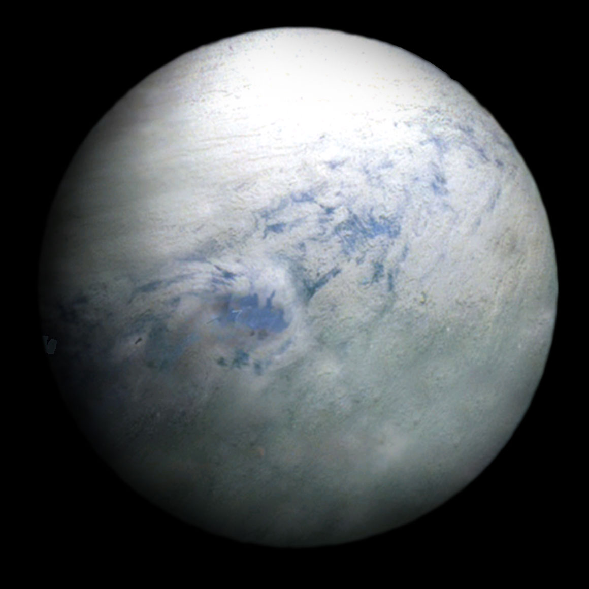
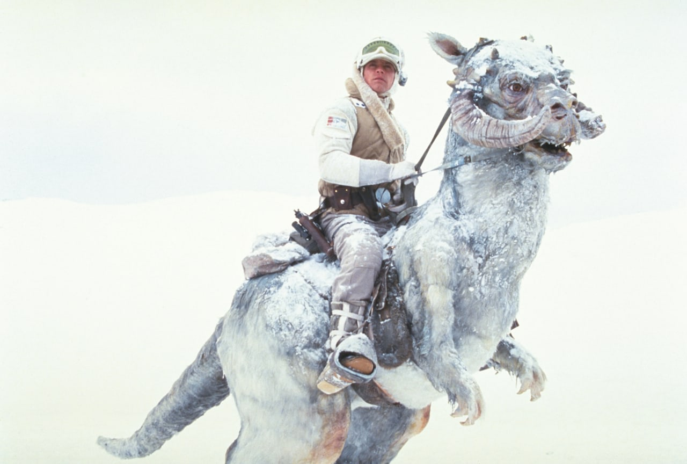
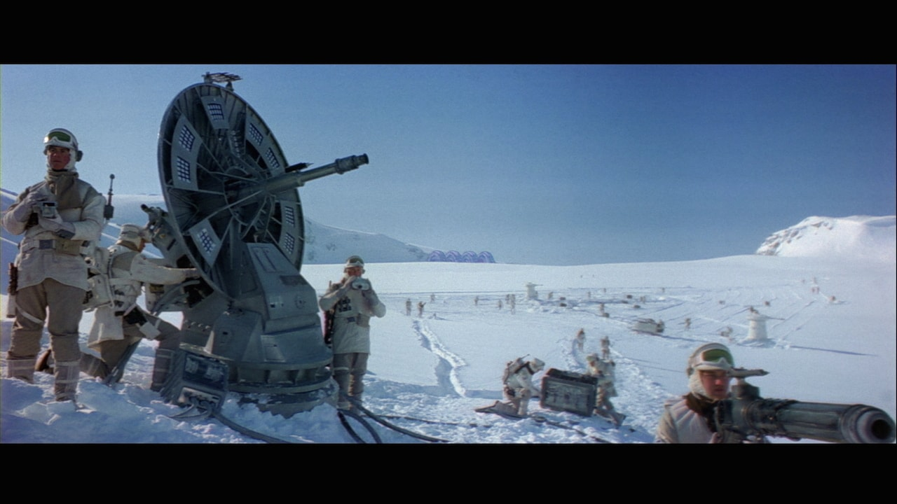

Don’t be turned off by the bitter chill of Hoth. This is an ideal planet for an adventurous vacation. Put on the warmest clothes you own or just all of your clothes at once, pack food in, and make camp in the remains of Echo Base. From there, it’s all about snowshoeing and looking for pet tauntauns.

Areas to avoid: Wampa caves, the insides of tauntauns

Echo Base’s rebels had trouble adapting their machinery to Hoth’s icy temperatures, so a low-tech solution to security was found: Rebel scouts such as Luke Skywalker patrolled the snowy plains on tauntauns, furred lizards that had evolved to withstand the frigid conditions.

After deciding on Hoth as a new base of operations, the Rebel Alliance’s engineers went to work, enlarging caverns to house rebel star fighters, transports and snow speeders. A massive ion cannon and shield generator defended Echo Base from Imperial warships.