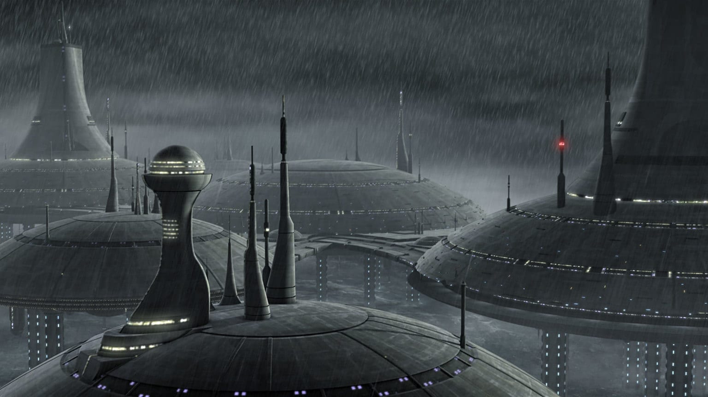

Purged from the otherwise complete Jedi Archives is all evidence of the mysterious world of Kamino. A lonely world beyond the Outer Rim and just south of the Rishi Maze, few could have predicted that Kamino would become a key contributor to a massive shift in political power in the final days of the Republic. Kamino is a planet of endless oceans and storms. Few features mark its surface, save for massive stilt-mounted cities wherein reside the planet's natural inhabitants, the Kaminoans. From Tipoca City, the planet's Prime Minister rules. Lama Su closely monitored the operations of Kamino's most prized export: clones.