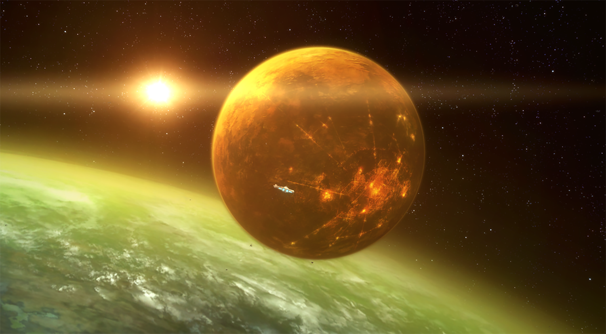

A ringed, marshy bog planet controlled by the Hutts, Nal Hutta has long been a haven for criminal activity, far from the prying eyes of galactic authorities. Its hot atmosphere is frequently streaked by greasy rain, creating a fetid sauna in which Hutts are most comfortable

The Hutts built only a handful of spaceports on the surface of Nal Hutta in order to connect their towns, settlements, and palaces, as the planet received few visitors due to most business with offworlders being conducted on the planet's largest moon, Nar Shaddaa. The foremost of these spaceports was the planet's capital city, Bilbousa, a sprawling mess covered in arching roots that spread out from looming bulbous pods. Within sight of the city was the Palace of Gardulla Besadii the Elder, one of the largest buildings on Nal Hutta, which served as the occasional headquarters of the Grand Hutt Council, the ruling body of the Hutt Clan that controlled the planet.