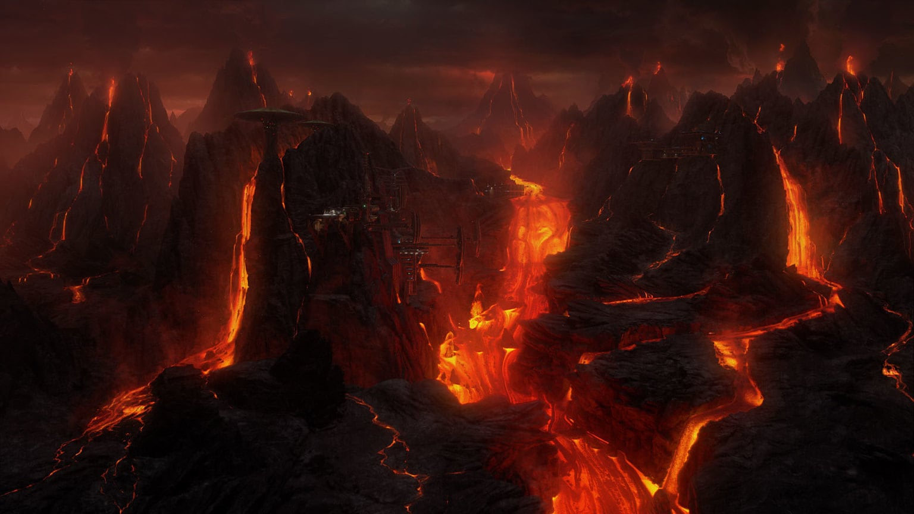

It’s a scary galaxy out there. Aside from Sith Lords and Imperial threats (and stormtroopers ruining the beautiful beaches of Scarif), travelers have to face threats of harsh terrain and harsher creatures. Some planets are so foreboding as to even send a chill up the spines of even the fiercest Jedi. So, in the spirit of Halloween, let’s take a look at some of the scariest Star Wars planets.

A tiny, fiery planet in the Outer Rim, Mustafar maintains an erratic orbit between two gas giants. Mustafar is rich in unique and valuable minerals which have long been mined by the Tech Union. Its lava pits and rivers make this planet a dangerous habitat; its natives have burly, tough bodies that can withstand extreme heat. The planet became the backdrop for the fateful duel between Obi-Wan Kenobi and Anakin Skywalker. After the rise of the Empire, captured Jedi were brought to the volcanic world for interrogation and execution.

