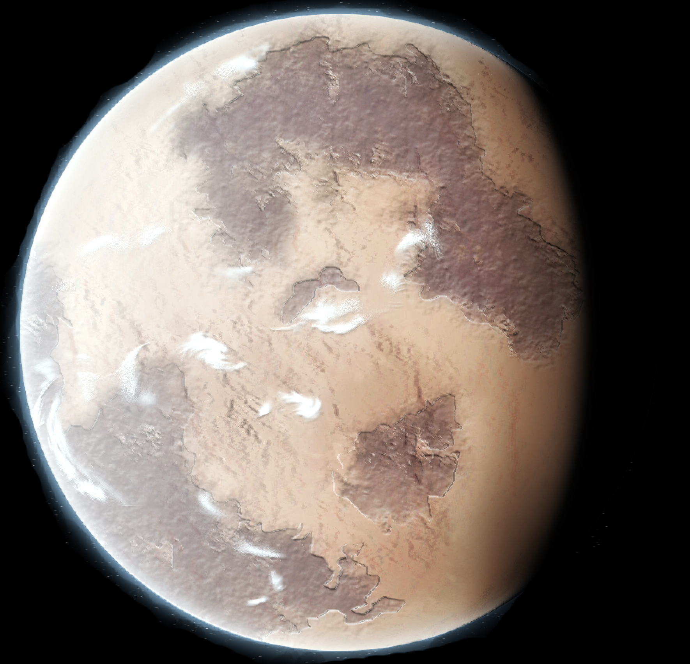
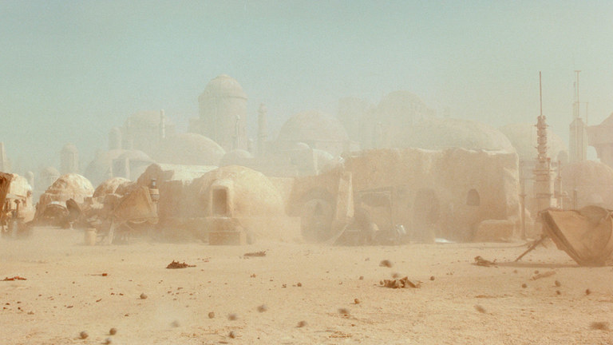

The desert planet may be covered in uncomfortable granules of sand (we know, Anakin, we know), but Tatooine offers sweeping vistas and beautiful dunes. You could tour sites such as the remains of the Lars homestead, go on a krayt dragon-viewing safari, and attend the Boonta Eve Classic.

Areas to avoid: Jabba’s Palace, sarlacc pits, Tusken Raider camps — wait, why are we considering visiting this planet?